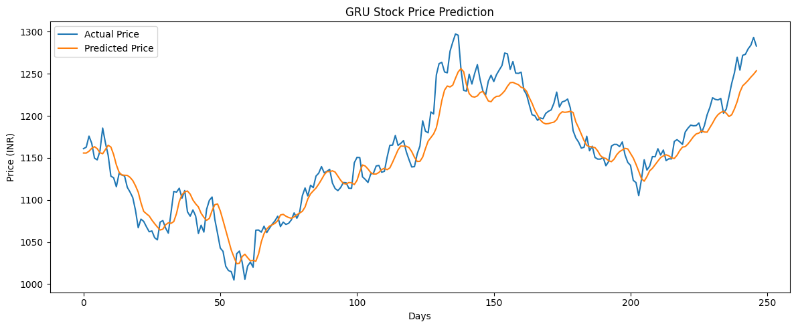

# 📈 Stock Price Prediction using GRU (PyTorch)

This project implements a deep learning-based time-series forecasting model using a Gated Recurrent Unit (GRU) network to predict stock prices from historical data.

The pipeline follows industry best practices including time-series cross-validation, hyperparameter tuning, and strict prevention of data leakage.

---
## Result

## 🚀 Key Highlights

- 🔁 Time-series forecasting using GRU (PyTorch)
- 🔧 Hyperparameter tuning using Optuna (Bayesian Optimization)
- 📊 TimeSeriesSplit cross-validation (no data leakage)
- 📉 Feature scaling using StandardScaler (train-only fit)
- 🧠 Sequence modeling using sliding window approach
- 🔄 Multi-seed evaluation for robust performance
- 📈 Metrics: R² Score and RMSE
- 📊 Visualization of predicted vs actual prices

---

## 🛠️ Tech Stack

- Python
- PyTorch
- NumPy, Pandas
- Scikit-learn
- Optuna
- Matplotlib

---

## 📂 Workflow

### 1. Data Preprocessing
- Cleaned and structured time-series data
- Applied feature scaling using training data only
- Created sequences using sliding window

### 2. Train-Test Split
- Chronological split (80/20)
- Maintained temporal order

### 3. Model Architecture
- GRU-based neural network
- Configurable parameters:
  - Hidden size
  - Number of layers
  - Dropout

### 4. Hyperparameter Tuning
- Performed using Optuna
- Tuned:
  - Learning rate
  - Hidden size
  - Number of layers
  - Dropout
  - Sequence length
  - Optimizer

### 5. Cross-Validation
- Used `TimeSeriesSplit`
- Ensured no data leakage

### 6. Final Training
- Retrained model using selected parameters
- Evaluated on unseen test data

### 7. Evaluation
- R² Score
- RMSE
- Visualization of predictions

---

## 📊 Results

- **Train R²:** ~98%
- **Test R²:** ~87 to 90%
- Stable performance across multiple random seeds

---

## 📉 Insights

- Model captures overall trend effectively
- Predictions are smoother than actual values (expected behavior)
- Slight overfitting observed but within acceptable range

---

## ⚠️ Important Concepts Applied

- Time-series aware validation
- Avoiding data leakage
- Context-based sequence prediction
- Robust evaluation using multiple seeds

---
## ⚠️ Key Learnings

- Importance of preventing data leakage in time-series  
- Using context window improves prediction quality  
- Hyperparameter tuning significantly impacts performance  
- Neural networks tend to smooth sharp fluctuations  
- Multi-seed evaluation improves reliability  

## 🔮 Future Improvements

- Add attention mechanism
- Experiment with Transformer models
- Predict returns instead of raw prices
- Include technical indicators (RSI, MACD)

---

## 📁 Run Instructions

### 1. Clone the Repository
### 2. Run this Command in your terminal
-pip install -r requirements.txt
-jupyter notebook